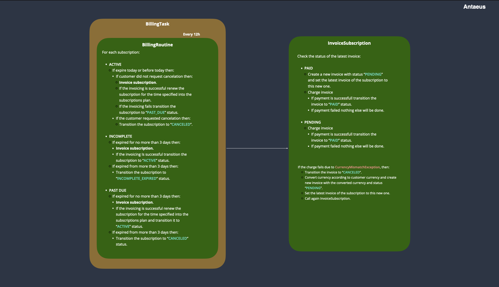

# Antaeus challenge documentation

First of all I would like to thank __Pleo__ for this opportunity.

I have to admit that I had quite a lot of fun playing with Kotlin for building the backend. My experience with Kotlin, before this project, is limited to the development of an Android application few years ago.

I divided the development of the proposed solution into three main tasks:
* Architecture design and implementation.
* Analysis of features that best fit for the solution (e.g. best practice for periodic tasks, how to test recurring task and similars) and implementation.
* Tests, refactoring and documentation.

## Architecture design and implementation

After an analysis of how Antaeus is modelled and implemented, I designed the system to fit the new requirements.
Since no boundaries were added into the challenge, I felt free to make some assumptions of how the system should ideally work.

Below is an image of the final design.

For each "customer" we can have several "invoices" associated with it, which obviously the customer has to pay. Each customer has a preferred currency for paying and each invoice has a certain value to pay into a certain currency. This is what Antaeus already provided out of the box.

My main contribution to this is the "Subscription" entity, which represents the customer's subscription to the system. Each customer can have at most one subscription to the system. Each subscription has the following fields:
- __cancel_at_period_ends__: _Boolean_

    - if __true__, at the expiration day the subscription will be canceled.

- __current_period_starts__: _String_

    - date related to the beginning of the invoicing period for the subscription.

- __current_period_ends__: _String_

    - date related to the end of the invoicing period for the subscription.

- __created__: _String_

    - date related to the creation of the subscription.

- __cancelled_at__: _String_

    - date related to the cancellation of the subscription (can be null).

There are also two fields (in green) that can be a possible extension (but they are not implemented):

- __trial_start__: _String_

    - date related to the beginning of the trial period for the subscription.

- __trial_end__: _String_

    - date related to the end of the trial period for the subscription.

The subscription has also a reference to the latest invoice. This information is often needed and therefore having this reference will avoid huge computations later on (mainly for scalability purposes).

Each subscription is related to a "Plan" entity. The plan represents different packages that the system offers (e.g. Standard plan or Premium plan). The plan has also a related price and currency, therefore each invoice will refer to the plan's price to charge the customers. This allows flexibility and scalability to the system. Moreover, the plan also gives the invoice interval time between each invoice. This allows to choose if the plan should be charged daily, weekly, monthly etc. Each plan has the following fields:

- __description__: _String_

    - description of the plan.

- __currency__: _String_

    - currency in which the price is represented.

- __price__: _Float_

    - price of the plan.

- __invoice_interval__: _String_

    - interval of time that should pass before charging again the customer (e.g. monthly).

Thanks to the plan the system gains lot of flexibility, that could allow for example having different "features" according to the plan. An example of plan and feature might be:

- Netflix Standard plan -> HD feature.
- Netflix Premium plan -> HD and 4k feature.

The feature entity was not implemented since is out of the scope of the challenge.

Each subscription has a "SubscriptionStatus" which represents the status of the subscription in a given moment of time. Similarly, the "InvoiceStatus" represents the status of the invoice in a given moment of time. The reason behind the choice of modelling this two entities as part of the database are mainly two:

- Scalability: having the status modelled as DB table allows addition of new statuses without the necessity of new deployment of the system.
- Localisation: one of the best practice is to localise the application for different languages server side; having the DB table modelling the status is the best and most efficient way to achieve this result (since Pleo is an international company, this is surely a much needed feature).

Below is represented the subscription lifecycle (the yellow squares represent a loop, ideally each 12 hours).

After the creation, the subscription will go to the "__incomplete__" state. Immediately after, the system will try to invoice the customer for the first time. If the invoice is successfully charged the subscription goes to the "__active__" status and the _current_period_starts_ becomes equal to today's date and the _current_period_ends_ becomes equal to today's date plus the _invoice_interval_ period. If the invoicing fails (e.g. customer does not have enough money) the subscription remains into the "__incomplete__" state.

Each 12 hours the task scheduler will perform the billing routine, checking all the subscriptions. For the subscriptions that are on "__active__" state it will be checked if the _current_period_ends_ equals to today. If this is the case, check if the "cancel_at_period_ends" is true. If so, the subscription will be move to the "__canceled__" state. Otherwise, a new invoice will be created and charged. If the invoice is successfully charged the subscription will stay into the "__active__" state. Otherwise, the subscription will be moved to the  "__past_due__" state.
For the subscriptions that are on "__incomplete__" or "__past due__" state, will be first checked if they are into this state for longer than 3 days. If so, if the current state is "__incomplete__" the subscription will be moved to the "__incomplete_expired__" state. If the current state is "__past_due__", the subscription will be moved to the "__canceled__" state.

Below is represented the invoice lifecycle.

After the creation, the invoice will be moved to the "__pending__" state. Once an invoice is being charged successfully this will move to the "__paid__" state. If during the attempt of charging a "CurrencyMismatchException" is raised, then the invoice will be moved to the "__canceled__" state. For any other reason of failure (e.g. no money into the customers account), the invoice will stay into the "__pending__" state. The reason why the "__canceled__" state is that for this particular situation, a new invoice will be created and attempted to charge immediately, without waiting a new cycle of the scheduler task.

Below is schematised everything just mentioned.

## Analysis of features and implementation.

Below is a glance of the implemented classes and functions for the core functionalities.

#### TimerTask

One of the main features to be implemented is the timer task, needed to schedule the billing service in order to charge the invoices. Besides the famous Quartz scheduler, that I had been using in the past, I found out that Kotlin has a very interesting feature called "__coroutines__". The coroutines are definitely not the best approach for solving the actual problem, but are surely something definitely worth to learn. I therefore went ahead implementing the task scheduler using the latter. The way the __TimerTask__ is implemented it allows an easy way of testing it (by accepting as input the function body to repeat). Because of the way the TimerTask is implemented, an immediate problem that I figured was that the time of delay between each execution of the task is not constant, due to the execution time the function to repeat takes to complete. Every cycle takes therefore: time_of_execution + delay where time_of_execution is variable according to the amount of data to process. This variable information does not allow a constant execution of the task (e.g. each 12 hours). A solution for this problem is to compute the time the execution of the function takes and remove this time from the repeating time delay. E.g. if the repeat time for the task is 4 seconds, and the task takes 1 second to execute, instead of waiting 1s (function execution) + 4s (repeat time) for the next execution, the actual time to wait will be 1s + (4s - 1s).

#### Retry on exception for Network exception

Another small issue to tackle is the fact that if the task has a network exception problem, it should be able to retry at least three times before giving up the charge. This was implemented into a separate class (for reusability and flexibility purposes) that handles the retry of the exception, called __RetryOnException__.

#### Other

###### Currency Provider
A small __CurrencyProvider__ it was implemented to handle the currency exchange between different currencies. A hardcoded map was used for the purpose just for mocking the provider.

###### Notification Provider
The __NotificationProvider__ is just a mocking of an email notification service provider.

## Tests, refactoring and documentation

The unit tests coverage is good. Currently, 23 unit tests are written for all the main functionalities of the core classes. An extension class called "__EmbeddedDb__" was created in order to refactor the creation logic of an in memory database. H2 was chosen as in memory database for testing since the sqlite version does not keep the data in memory after the end of a transaction. Extending the "__EmbeddedDb__" class, each test will have at disposition a completely empty database where it is possible to perform any type of operation. This operation, despite taking quite a few hours to fully understand how it work, allowed a much easier integration and realisation of the unit tests.

As previously mentioned, the unit test coverage is also related to the TimerTask, where are being tested all the basic functionalities (e.g. Start, Shutdown etc.) together with the delay between calls.

#### Other

###### Database refactoring
The database data access layer classes have beed refactored since the AntaeusDal class was becoming a blob.

###### Rest APIs extension
New rest APIs endpoint were added in order to allow starting, stopping and checking the status of the task.